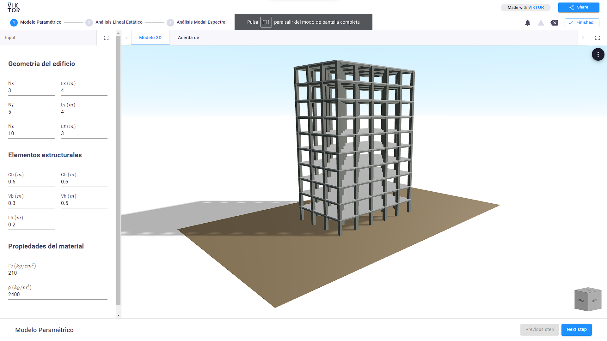

# VIKTOR-OpenseesPy

The codes of this application are part of the course material ["Seismic Analysis of Buildings with OpenseesPy"](http://jpi-ingenieria.online/courses/course-v1:JPI-INGENIERIA+ASEP+2022_T1/about) from [JPI Engineering and Innovation](https://jpi-ingenieria.com/python_ingenieria.html)

This sample app shows how to parametrically analyze a reinforced concrete building based on a frame structural system, using the finite element package OpenseesPy as a calculation engine.

The goal of the application is to show how the VIKTOR platform is used to provide a graphical interface to OpenseePy-based code. This application shows in a parameterized way the structural analysis of reinforced concrete buildings, applying static analysis and spectral modal analysis in order to know the seismic response of the building in a simplified way.

Although this app only shows analysis in the linear range of the building, it could be extended to perform nonlinear analysis such as PushOver or a Nonlinear Dynamic Analysis.

A published version of this app is available on [students-uni-fic-pe.viktor.ai](https://students-uni-fic-pe.viktor.ai/public/viktor-opensees)

A tutorial for this app is available on [Humberto Rojas](https://www.linkedin.com/posts/humberto-rojas-huaroto-63908321a_openseespy-webapp-openseespy-ugcPost-7032172680837496833-MlbS?utm_source=share&utm_medium=member_desktop)

# App structure
This is an editor-only app type.
